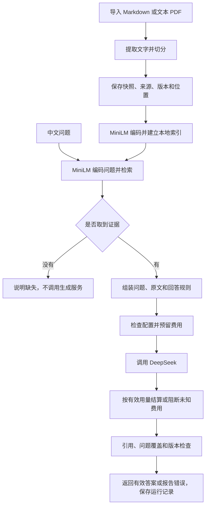

# 安全知识研究助手：从简历到实现的完整学习讲义

更新日期：2026-09-17。按你提供的简历内容重写，面向能够阅读基础 Python、但尚未熟悉检索和大模型工程的学习者。

这份讲义的目标是：你能从一份资料开始，解释它如何进入数据库、如何被中文问题找到、如何变成带证据的回答；也能解释为什么会失败、怎样检查失败，以及简历里的每一项究竟做到了什么。先理解，再动手，最后才进入模拟面试。

当前实现依据本地代码与 2026-09-12 收尾证据。历史核查另存为 [收尾前审查备份](project-audit-before-lecture-rewrite-20260917.md)，最终交付边界见 [收尾说明](closeout-20260912.md)。本文不修改业务代码，也不把尚未做的能力写成已完成。

## 阅读路线

第一次按第 1—5 章阅读，弄清主流程；第二次读第 6—10 章，理解检索实验、指标、预算和测试；第三次做第 12 章练习，最后用第 13—14 章组织自己的表达。遇到公式先看它前面的例子，不必先背公式。

| 你的简历内容 | 对应讲义 |
| --- | --- |
| Python、SQLite、Sentence Transformers、MiniLM、DeepSeek | 第 1、2、4、5 章 |
| 四种切分、快照、来源、版本、行号/页码 | 第 3、6 章 |
| 结论、引用、问题覆盖与资料失效 | 第 5、6 章 |
| BM25、RRF、最多两轮补充检索 | 第 7、8 章 |
| 开发集、保留集、证据束、宏平均 Recall@5 | 第 9 章 |
| 事务、费用预留、结算、未知费用阻断 | 第 10 章 |
| 持久化、失败离线重放、自动化测试 | 第 11 章 |
| 跑通项目、讲清个人贡献与面试表达 | 第 12—14 章 |

先纠正一个数量：你简历里的 **148 项**是早期版本的测试数量。收尾后已有 **155 项通过**的保存日志，建议简历更新为 155。这里指测试用例数量，不是覆盖率，更不是 155 道真实问答都答对。本次改讲义不重新声称做了一次真实生成验收。

---

## 1. 先用普通话说清：这个项目在做什么

### 1.1 用户真正的需要

假设你正在读几份英文安全资料，想问：“应该如何限制智能助手使用工具的权限？这些办法能减少多少误操作？”

你希望得到中文解释，但还希望知道：这句话出自哪份资料？原文到底怎么说？资料没有给数据时，系统会不会编一个数字？资料更新后，系统还会不会引用旧说法？

本项目围绕这些问题建立了一条流程：**先找你导入的原文，再让模型依据原文组织回答，最后检查回答是否符合规定，并留下可回查的记录。**

这种做法叫 RAG，英文是 Retrieval-Augmented Generation，中文通常叫“检索增强生成”。三个词可以拆开理解：检索是找原文，增强是把找到的原文补进模型输入，生成是让模型组织语言。原文进入的是这次请求，不是通过训练写进模型参数。模型参数是模型在训练中形成的内部数值；本项目不修改它们。

### 1.2 “安全知识”与“安全机制”是两件事

资料主题是提示注入、工具权限、最小权限等安全知识。

- 提示注入：不可信内容里夹带指令，试图让模型偏离用户真正的任务。例如待阅读文档里写“忽略之前的要求”。
- 工具权限：程序允许助手调用哪些功能，例如读文件、发送消息、删除文件。
- 最小权限：只提供完成任务所需的权限，避免给出无关的能力。

系统自身还做了引用、资料版本、费用等检查。但本项目没有测出“抵御提示注入的成功率”，也没有训练一个安全防护模型。资料主题与系统效果指标不能混为一谈。

### 1.3 “本地”意味着哪些东西在本机

| 部分 | 在哪里执行 | 负责什么 |
| --- | --- | --- |
| Python 程序 | 本机 | 串起导入、检索、校验、记账等步骤 |
| SQLite 数据库 | 本机文件 | 保存资料、片段、向量、运行记录与独立费用账本 |
| Sentence Transformers 与 MiniLM | 模型准备好后在本机 CPU（处理器）执行 | 把问题和文本转成用于比较的数字 |
| DeepSeek API | 外部服务 | 根据传入的问题和证据生成中文回答 |

API 就是程序调用外部服务的约定：按约定发请求，按约定收结果。本项目通过网络发送问题和检索片段给 DeepSeek，因此真实问答不是“所有内容完全不出本机”。离线检索、测试和离线重放可以不调用它。

SQLite 是一个数据库程序库，直接读写本地数据库文件，不需要你额外启动一个数据库服务器。这里数据量很小，用它便于安装、检查和复现。项目没有使用独立的向量数据库服务。

运行入口是命令行，简称 CLI：在终端输入命令，再查看程序输出。当前项目没有聊天网页界面。

---

## 2. 先走一遍完整流程，再研究细节

### 2.1 一个贯穿全文的教学例子

以下两句是为了讲解流程编写的示例，不是假称来自 OWASP 的逐字原文，也不是新的实验结果：

```text
第 10 行：Grant the assistant only the permissions required for its task.
第 11 行：Require human approval before deleting files.
```

问题是：“应该怎样限制助手的工具权限？这些措施能减少多少误操作？”

人读完可以说：“只授予任务所需权限，删除文件前要求人工批准。”但不能从这两句话推导“减少 40% 误操作”。你的程序要尽量让模型遵守这个边界。

### 2.2 准备资料时发生的事

1. 读取文件，确认是支持的格式，并取得标题、来源、许可和取得日期。
2. 保存当次读取的内容。以后核对证据时，就能知道当时读的是什么。
3. 根据切分规则，把长文分成若干可单独检索的片段，同时保存原文位置。
4. 将每个片段交给本地 MiniLM，得到一组数字，并建立片段与数字的对应关系。

这些操作通常在导入、更新或建立索引时做，不需要每问一个问题都重新读取所有原始文件并编码所有片段。

### 2.3 用户提问时发生的事

1. 中文问题也经过同一个 MiniLM 编码。
2. 将问题的数字表示与库里片段的数字表示比较，挑出相似度较高的片段。
3. 如果没有取到证据，直接说明缺失，不发生成请求。
4. 如果取到了证据，组织请求：回答规则、问题、带标识的原文片段。
5. 检查本机配置、输入大小和费用额度，先在账本预留费用。
6. 请求 DeepSeek。它返回中文结论、英文引文、中文释义，以及每个问题项的回答情况。
7. 如果服务给出有效用量，按用量记账；即使答案不合格，已发生的调用也不能当免费。
8. 检查格式、引用、问题覆盖与证据版本。检查不通过时拒绝展示为有效回答，保存可用的错误信息。
9. 检查通过后，返回答案、引用与缺失说明，保存运行记录供回查。



图里“有证据”只意味着找到了候选原文，不意味着原文一定能回答问题。向量检索通常总能找到一些相近文本；要不要回答、能回答哪些内容，还需要后续判断。

### 2.4 两个容易混淆的数量

普通 `ask` 回答路径在代码中请求 **3 个片段**。检索评测通常使用 **前 5 个片段**。这两个设置不是同一个设置。

因此，一段关键证据在第 5 名，可能在 Recall@5 评测里算取回，却没有进入普通问答输入。后面的 Q06 失败案例正与这类差异有关。

---

## 3. 第一条经历：资料导入、四种切分与证据定位

### 3.1 文件、原文快照、片段分别是什么

文件是你提供的 `.md` 或 `.pdf`。Markdown 是用普通文字和少量符号表达标题、列表、代码的格式，例如 `##` 表示标题，三个反引号包围代码。

原文快照是导入时保存的内容。可以理解为“这次读取内容的留底”。Markdown 保存读取的文字；PDF 保存按页提取的文字内容。PDF 快照不是把完整原始 PDF 文件作为二进制附件存进数据库。

片段，代码里常叫 chunk，就是系统实际拿来检索和提供给模型的一小块文字。一份文件可被切成很多片段。

为什么不每次把整本资料塞给模型？长文会增加输入费用，也可能让关键内容被大量无关文字淹没；模型可接收的输入长度还有上限。先检索少量相关片段，是在成本与信息完整性之间做选择。

片段也不能越小越好。把“需要用户授权”与“可以删除文件”拆开，只取回后半句，就可能丢掉关键条件。

### 3.2 导入时保存哪些信息，分别有什么用

| 信息 | 普通话解释 | 用途 |
| --- | --- | --- |
| title | 资料标题 | 让用户识别文档 |
| source | 来源地址或来源标识 | 区分不同资料，同来源更新时找到原记录 |
| license | 使用许可 | 保留取得资料时记录的许可信息；程序不会替你核实许可真实性 |
| acquired | 取得日期 | 知道资料是什么时候获取的 |
| snapshot | 当次读取内容 | 回看导入时的原文 |
| hash / version | 内容指纹 | 识别文件内容是否变化 |
| doc_id | 文档标识 | 将片段与所属资料关联 |
| chunk id | 片段标识 | 检索结果、引用与运行记录共同使用的定位编号 |
| section | 章节标签 | 帮助理解片段属于哪个主题 |
| start_line / end_line | 起止行号 | 定位原文范围，从 1 开始 |
| page | PDF 页码 | 定位到文件第几页，从 1 开始，不一定等于页内印刷页码 |
| active | 当前是否有效 | 防止历史片段进入新检索 |
| kind | 正文或元数据标签 | 区分内容与来源、许可、页眉页脚等说明 |

元数据就是“描述资料的信息”，例如来源和许可；它不一定是用户问题需要的知识正文。当前代码给这类内容打标签，但不能保证它们永远不占检索名额。

### 3.3 内容指纹不是加密，也不是语义摘要

项目用 SHA-256 算法计算文件字节的指纹。它把输入变成固定长度的字符串，内容改变时指纹通常也改变。这里用于版本和复现检查，不是保护文件机密，也不能靠指纹还原原文。

文档标识由来源字符串生成；文件版本由文件内容生成；片段标识结合文档、版本、切分策略及位置等信息生成。这样，换了内容或切分方式后，不会轻易把新旧片段当作同一块。

只改换行格式也可能改变文件字节，从而改变版本。这解释了为什么冻结语料时还要固定换行格式，不能只看“打开后文字好像一样”。

### 3.4 基线切分：标题加固定行数

代码名 `heading-lines-v1:20`。基线就是最初用于比较的参照方案，不是指效果最差的方案。

它遇到 Markdown 标题开始新片段；没有新标题时，累计到最多 20 行就切开，空行也参与计数。它识别代码围栏内部的标题符号，避免把代码中的 `#` 当成正文标题；但达到行数限制时仍可能拆开长代码。

例如一个章节有 45 行，可以按约 20、20、5 行分成几块。优点是简单、稳定、容易定位；缺点是第 20 行可能正好在说明中间。行数相同也不代表字数、token 数或信息量相同。

这是当前 Markdown 默认策略。

### 3.5 指南切分：有限的标题和列表连接规则

代码名 `heading-block-v2`。它尝试让说明型资料按标题组织，并将部分来源说明单独标出。

实际实现的重点有三项：遇到任意 Markdown 标题分段；识别部分元数据；正文仍使用 20 行阈值，但在切分点恰好是“冒号后紧接列表项”时延迟切开。

```text
建议采取以下措施：
- 限制权限
- 要求人工审批
- 记录操作
```

如果切分点恰好在冒号后，规则会尽量避免把介绍语与紧接着的列表项立即分离。它没有保证整张列表始终同块，也没有完整理解“定义—条件—例外”的语义关系。

尤其不要背旧说明里的“只在空行切分”“完整保留定义与列表”“完整理解标题层级”。当前代码并不是这样。它是一组确定性的文本规则：相同输入与配置会得到相同切分，不需要模型判断。

### 3.6 步骤代码切分：重点是完整代码围栏

代码名 `heading-procedure-v3`。它按标题形成单元，再按空行或普通文字行数限制拆分；对代码围栏作特殊处理，尽量把整个围栏作为一个片段内容保留下来，即使它超过普通行数限制。

代码围栏就是 Markdown 中用三个反引号或波浪线包围的代码区域。

```text
操作前先取得授权。

[一段代码围栏]

警告：该操作会删除文件。
```

这里的三个部分可能被空行拆开。保住代码的完整，不等于授权条件和警告一定跟着代码一起被取回。章节标签可以帮助定位，但“标签相同”也不等于“检索到了全部必要上下文”。

因此你可以讲“为代码围栏做了完整性处理”，不能讲“所有前提、步骤和警告永远完整绑定”。这正是切分策略需要评测的原因。

### 3.7 PDF 按页切分：先提取文字，再保留页边界

代码名 `pdf-pages-v1`。这里用 pypdf 库读取 PDF 的文字层，也就是 PDF 内可提取的文字内容。

扫描件通常只是文字的图片，需要 OCR 才能识别。OCR 的意思是从图像识别文字，本项目没有实现它。如果完全提取不到正文，会明确报错。

提取后，每一行保留所属页码。切分不会跨页合并，一页内仍可能因标题或内容分类形成多个片段。因此“按页”不等于“每页严格只有一块”。行号基于提取后的文字序列，回查 PDF 时应结合页码，而不是假定版面上原本存在同样的行号。

重复页眉页脚可以标为元数据。程序还用大量碎片短行等规则发现一部分提取异常；这不能保证检测出所有阅读顺序错误。双栏和复杂表格并没有被完整重建。

### 3.8 谁选择切分策略

Markdown 默认基线，需要通过 `--splitter` 显式选指南或步骤策略。PDF 默认选择 PDF 策略。结构策略找不到标题时可能回退到基线。

这不是模型自动判断整份资料类型，也不是一次导入同时产生四套索引。比较实验会为不同策略分别建立临时库，让它们在相同原文上比赛。

你应能独立回答：为什么要切分？为什么保留位置？四种规则各做了什么？它们各自会在哪种情况下丢失上下文？

---

## 4. 总述里的核心：中文问题如何找到英文原文

### 4.1 Sentence Transformers 与 MiniLM 的关系

Sentence Transformers 是使用文本编码模型的 Python 工具库；MiniLM 是实际使用的模型。可以类比为播放软件与具体音源，二者不是同一个东西。

本项目使用 `sentence-transformers/paraphrase-multilingual-MiniLM-L12-v2`。名字中的 multilingual 表示支持多语言；其训练使不同语言里意义相近的文字有机会得到相近的表示。本项目使用预训练模型，没有在自己的 20 道题上训练或微调它。微调是用新数据继续调整已有模型的参数，本项目没有这一步；这 20 题用于评测。

“中文问题对英文资料的检索”不是先逐字翻译中文，再搜索英文词；当前纯向量路径将两者交给同一编码模型，直接比较它们的表示。

### 4.2 向量到底是什么

向量在这里就是一串数字。模型将一段文字变成 384 个数，可以抽象写成：

```text
“只给任务需要的权限” → [0.12, -0.08, 0.31, ……共 384 个数]
```

这些数不是程序员手工设置的“安全分”“权限分”。单个数通常没有直观的人类含义，整串数用于比较文本之间的接近程度。

这种表示也叫 embedding，中文常译为“嵌入”。本文直接把它理解成“文字的数字表示”即可。

### 4.3 相似度怎样计算

本项目使用余弦相似度：比较两个向量的方向是否接近。方向越接近，得分通常越高。

计算前，把向量长度调整到 1，这一步叫归一化。归一化以后，两个向量逐项相乘再加起来，就能得到余弦相似度：

```text
相似度 = 问题第1个数 × 片段第1个数
       + 问题第2个数 × 片段第2个数
       + ……
```

通常范围是 -1 到 1。得分 0.8 不代表“答案正确概率为 80%”。它只是该模型和这套计算方式下的相似程度。

一段反对某方法的文字，也可能与询问该方法的问题非常相似；主题相关不等于支持某个结论。

### 4.4 长片段怎样处理：还有一种“切分”

模型一次能有效处理的序列长度有限。token 是模型分词后的单位，不一定等于一个英文单词或一个汉字。

项目先将片段转换为 token，每约 100 个 token 分成一段，分别编码；把各段的归一化向量取平均，再归一化，形成原片段的一个最终向量。这是为了避免直接把长片段后面的内容静默截断。

这里有两层不同的切分：

| 切分位置 | 产生什么 | 会不会改变引用片段 |
| --- | --- | --- |
| 文档切分 | 可检索、可定位的原文片段 | 会 |
| 编码时的 100-token 窗口 | 计算原片段向量的内部小段 | 不会；最终仍对应原片段 |

多个窗口平均后，某一句很关键的内容可能被其他内容稀释。所以“没有截断”也不等于“所有信息都同样容易检索到”。

### 4.5 索引是什么，为什么要重建

索引在这里可以理解为“提前算好的片段数字表示，以及它对应哪个片段”。`index` 命令把这些信息保存到 SQLite。

提问时只需编码问题，再与已有向量比较。当前实现遍历所有向量计算得分并排序，叫精确检索：没有先用近似方法缩小搜索范围。对几十个片段足够简单；当数据规模大幅增加时，这种逐个比较会变慢。

数据库还保存语料指纹和编码器身份。资料增加、更新、删除，或模型身份改变后，旧索引会被拒绝使用，要求重新运行 `index`。程序不会假装旧向量仍代表新文字。

### 4.6 为什么没有选择更复杂的框架

当前问题规模小，直接用 Python、SQLite 和编码库，容易看清每一步的数据和错误；也不需要维护独立服务。

这不是说其他框架不好，而是这个项目没有证明需要增加它们。面试时不要凭印象说用了 LangChain、FAISS、Chroma 或重排序模型，它们不在本项目实际实现里。


---

## 5. 第二条经历：怎样把原文变成有依据的回答

### 5.1 发给 DeepSeek 的是什么

程序主要提供三类内容：回答规则、当前问题、检索到的证据。每条证据带自己的标识和原文，以便模型说明引用了哪条。

回答规则要求事实结论来自这些证据、保留英文引文并给中文释义、缺信息时明确说明、不要调用工具。资料中的攻击指令只是待解释内容，不能取得程序执行权限。

这些规则组成提示词，也就是这次请求中告诉模型“做什么、依据什么、怎样输出”的文字。提示词能引导模型，但不是可靠的程序检查；因此生成之后还要校验。

API 密钥相当于调用服务的凭证，只从本机环境变量或隐藏输入取得，不应放在资料、简历或可公开的配置文件里。

### 5.2 为什么不用一大段自由文本

如果模型只返回一段中文，程序难以知道哪句话是结论、哪句是引文、哪一问还没答。

所以项目要求 JSON。JSON 是用字段名、列表和数值组织数据的一种文本格式。可以把它看成一张模型必须按规定填写的表格。

主要有三个部分：

- `claims`：结论列表。每条结论包含中文文字和它引用的证据标识。
- `citations`：引用列表。每条包含证据标识、英文逐字引文 `quote`、中文释义 `translation`。
- `coverage`：问题覆盖记录，说明每个问题项关联哪些结论，缺少什么。

这三层关系应当能用一句话表达：**某个问题，由这些结论回答；这些结论，由这些原文引用支持。**

### 5.3 一个完整的结构示例

以下使用第 2 章的教学原文。`evidence-A` 是便于阅读的示例标识，实际标识是程序生成的长字符串。

```json
{
  "claims": [
    {
      "text": "应只授予助手完成任务所需的权限。",
      "citations": ["evidence-A"]
    }
  ],
  "citations": [
    {
      "id": "evidence-A",
      "quote": "Grant the assistant only the permissions required for its task.",
      "translation": "只授予助手完成任务所需的权限。"
    }
  ],
  "coverage": [
    {"question_id": "q1", "claims": [0], "missing": ""},
    {"question_id": "q2", "claims": [], "missing": "提供的资料没有给出误操作减少数量。"}
  ]
}
```

这里 `claims: [0]` 表示关联结论列表里的第一条。Python 等语言的列表通常从 0 编号，这个 0 不是零条结论。`claims: []` 才表示没有关联结论。

问题项 q1 是权限建议，q2 是误操作减少数量。程序根据这些记录汇总为 `partial`，也就是部分有据。

### 5.4 问题覆盖怎样产生，检查到了哪一层

程序先按问号、分号、换行等标点拆分问题，分配 q1、q2 等标识。它没有完整的语义任务规划器；一个没有这些分隔符的长句，可能仍是一个问题项。

模型按问题项填写 coverage。程序检查：条数与顺序是否对应；关联的结论序号是否存在；没有结论时是否写明缺失；是否有结论根本没关联到任何问题。

这可以减少“回答了第一问，却静悄悄漏掉第二问”的情况，但不能证明语义上真的答到了点上。例如模型把“原则建议”错误关联到“具体数量”，仅靠索引合法无法彻底识别；需要规则引导和人工复核。

同一个问题项内部也允许部分回答：既关联有据结论，又说明该项尚缺的内容。

### 5.5 校验程序依次关心什么

| 检查 | 能挡住的错误 | 不能据此保证的事情 |
| --- | --- | --- |
| JSON 和字段类型合法 | 返回的不是 JSON、缺列表、字段类型错误 | 语言表达或事实正确 |
| 引用标识在本次证据里 | 模型编造一个从未提供的证据 ID | 被选证据真的支持结论 |
| quote 是对应原文的连续子串 | 引文自己添词、删掉中间文字、引错片段 | 断章取义、忽略否定和适用条件 |
| 中文释义非空 | 漏掉释义 | 翻译准确 |
| 每条结论有合法引用 | 没依据的结论直接混入回答 | 推理关系成立 |
| 问题覆盖结构一致 | 漏填问题项、引用不存在的结论序号 | 实际语义覆盖全部子问题 |
| 证据仍是当前有效版本 | 生成期间资料已更新或删除 | 任意外部检索源的版本真实性 |

逐字匹配可以直接理解为 Python 的 `quote in evidence_text`。不是“意思差不多就通过”，而是引文必须真实出现于提供的文字中。翻译作为释义另放，不拿译文冒充英文原文。

同一个片段可以支持多处不同引文，因此不能只因引用 ID 相同就全部删掉。程序允许同片段的不同引用内容，拒绝完全重复条目。

### 5.6 三种回答状态怎样区分

| 状态 | 含义 | 教学例子 |
| --- | --- | --- |
| grounded：完整回答 | 有结论，问题覆盖中没有缺失说明 | 只问怎样限制权限，资料已提供足够建议 |
| partial：部分有据 | 至少有一部分能答，同时还有信息缺失 | 权限建议能答，减少多少误操作不能答 |
| insufficient：证据不足 | 没有可用结论，有明确缺失说明 | 只问减少多少误操作，资料没有数据 |

`grounded` 是程序根据模型填写的结构汇总出的状态，不能理解为已经通过一个全知的事实检查器。

“未取到候选”和“取到候选但没有答案”都会遇到证据不足，但发生位置不同：前者可以直接返回，不调用生成；后者需要根据候选内容判断，真实路径可能已经产生费用。

### 5.7 为什么这仍然不是“零幻觉”

设原文说：“This method does not always work.”，模型引用完全正确，却总结为“该方法始终有效”。逐字匹配仍可能通过，因为引文存在，但结论把意思反了。

所以项目的价值是让结构、来源和版本中的一批错误可检查，让读者能够核对；并没有消除全部语义错误。真实生成验收需要人逐条对照结论、英文原文和中文释义。

---

## 6. 资料更新与删除：怎样阻止旧证据再次使用

### 6.1 为什么不能只改原始文件

程序检索的是数据库中的片段和向量，不是每次临时打开你桌面上的原始文件。因此你修改磁盘文件后，库内快照不会自动更新；这是避免内容在没有记录的情况下悄悄变化。

更新必须经过导入或更新流程，让程序计算新版本、生成新片段，并记录变化。

### 6.2 同来源更新时的顺序

假设来源地址不变，原文从“允许直接删除”变成“需要批准后删除”：

1. 用相同 source 找到原资料。
2. 计算新文件指纹和新切分结果。
3. 在一个数据库事务中，将旧片段设为 inactive，替换当前文档记录，写入新片段。
4. 后续检索只取有效片段。
5. 向量检索发现语料指纹变化，要求重建索引。

事务的直观含义是：这一组相关数据库修改要一起成功；发生错误时，不让用户看到只改了一半的状态。第 10 章会用费用例子继续解释。

同来源、同内容、同切分器重复导入，会返回 unchanged。内容相同但切分器不同，片段也会重新发布；版本判断不能只盯文件文字。

### 6.3 删除不是把历史痕迹全部抹掉

删除来源会移除当前文档记录，并将它的片段设为失效。正常 `read` 和新检索不能继续把它当当前证据。

运行记录仍可能保留当时使用的内容，失效片段也可能留在数据库中。这是为了历史回查，不是安全擦除承诺。项目也没有一套完整的任意历史文档版本恢复界面。

### 6.4 为什么回答生成后还要再检查一次

有一种时间差：检索时拿到旧片段；DeepSeek 还在生成时，资料被更新；生成结束后如果直接返回，就会展示已经过期的结论。

因此程序在返回有效回答之前再检查片段。如果它已失效或版本变化，就阻止旧回答返回，并提示重新查询。

这个防护针对本地库中的证据。为测试或扩展注入的外部片段如果不属于本库，当前函数不能证明其版本有效，因此不能把本项目描述为对任意外部数据源都做了完整版本验证。

### 6.5 回查与有效性是两种用途

“我能回看上次回答用了什么”是在检查历史；“我现在能不能继续用这段证据回答”是在检查当前有效性。

允许查看历史记录，不意味着历史内容可以继续进入新回答。这是持久化记录与版本控制需要一起设计的原因。

---

## 7. 第三条经历之一：BM25 与 RRF 为什么要做实验

### 7.1 先理解 BM25 解决的是什么

BM25 是依据词项匹配给文本打分的方法。词项就是分词后用来匹配的单位，本项目使用简单规则识别英文、数字和中文文本，并复用少量中英术语映射；没有通用翻译系统。

例如问题含 `least privilege`，BM25 会看候选片段里出现这些词的情况。它主要考虑三件事：

1. 查询词出现得越多，通常越相关，但从第 1 次到第 2 次的收益，不应该与从第 99 次到第 100 次一样大。这叫词频饱和。
2. 所有片段都有的普通词区分力较低，较少片段出现的查询词区分力可能较高。这叫逆文档频率，常缩写为 IDF。
3. 很长的片段更容易碰巧出现查询词，需要适当调整长度影响。这叫长度归一化。

在这里，算法公式里的“文档”实际对应参与检索的片段，不一定是一整份原始文件。

### 7.2 用一个例子理解词频和长度

片段 A 有 20 个词，`privilege` 出现 2 次。片段 B 有 200 个词，出现 3 次。

如果只数出现次数，B 可能更靠前。但 B 长了十倍，额外那一次出现未必证明它更聚焦。BM25 同时考虑词频与长度，因此可能更偏向 A。实际次序还取决于其他查询词和整批语料，不能只凭这两个数字直接断言。

### 7.3 公式放在理解之后

项目采用的形式可以写为：

```text
BM25(问题, 片段) = 对每个查询词，把下面这一项加起来：

IDF(词) × [词频 × (k1 + 1)]
        ÷ [词频 + k1 × (1 - b + b × 片段长度 / 平均片段长度)]

IDF(词) = ln(1 + (N - df + 0.5) / (df + 0.5))
```

N 是有效片段总数；df 是出现该词的片段数；ln 是自然对数，这里用于压缩数值增长。k1 控制词频增长的影响，b 控制长度调整程度。项目固定 `k1=1.5`、`b=0.75`，没有在保留集上反复调参。

你不必先背公式，但应能解释它为什么比“统计命中词数”多考虑两层因素。代码还对匹配正文优先排序；这是实现里的额外规则，不属于 BM25 数学公式本身。

### 7.4 为什么它在本项目容易失败

中文问“工具权限应该如何限制”，英文原文只出现 `tool permissions` 和 `least privilege`，如果程序的有限映射没有覆盖相关表达，就可能没有共享词项。BM25 不会因为两个词组意思相近就自动理解它们。

所以它适合精确词语、缩写等匹配，但在本项目的中文问题—英文资料场景中可能很弱。不能把这个结论扩大成“BM25 在所有项目都差”。

### 7.5 RRF：把两份排名合成一份

RRF 的全称是 Reciprocal Rank Fusion，可理解为“按名次倒数加分的排名融合”。

为什么不直接把向量相似度与 BM25 分数相加？因为两者量纲和数值分布不同。一个检索器的 0.8 与另一个的 8，不能直接理解成后者重要十倍。

RRF 不用原始分数，只看名次。例如：

| 片段 | 向量排名 | BM25 排名 |
| --- | --- | --- |
| A | 1 | 未出现 |
| B | 2 | 1 |
| C | 3 | 2 |

项目等权融合时，每路贡献为 `1 / (60 + 名次)`：

```text
A：1/61                 ≈ 0.01639
B：1/62 + 1/61          ≈ 0.03252
C：1/63 + 1/62          ≈ 0.03200
```

所以 B、C、A 依次排列。B 虽然不是向量第一名，但两路都支持它，因此累积得分更高。

这里的 60 是平滑常数，用于减弱名次差距的影响，和最终取前 5 条里的 5 完全不同。没有出现于某路结果，就没有那一路的加分。

实现先向各路请求候选池，默认至少 10 条，再融合取最终所需条数。候选池就是“供最后筛选的一批结果”。返回的 `contributions` 记录每个片段在各路的排名，便于解释它为什么被选中。

### 7.6 为什么融合反而可能更差

假设向量第 5 名才是包含正确条件的片段，而 BM25 偏爱另一个词面相近、实际没有该条件的片段。融合后，后者可能把关键证据挤出前 5。

因此“多一种检索方式”不意味着一定提高效果。项目真实开发集结果是：纯向量 0.85，BM25 0.40，RRF 0.75。记录退化是实验结果，不应改写成“混合检索提升准确率”。

BM25、RRF 在本项目提供 Python 类和比较脚本。普通 CLI 的检索选项仍只有 keyword/vector。你简历写“实验组件”是准确且重要的限定。

---

## 8. 第三条经历之二：最多两轮补充检索

### 8.1 补充的目的

初次取回 A、B 两个片段，但回答仍缺一个条件。系统可以再检索，尝试找到 C，然后用 A、B、C 一起作答。

跨轮保留已找到的证据，并按片段 ID 去重，叫累积证据。下一轮不把前一轮片段无故丢掉。

### 8.2 “两轮”怎样计数

```text
第 0 轮：初次检索
第 1 轮：第一次补充
第 2 轮：第二次补充
到此为止
```

最多是三次检索机会，不是只检索两次。也不等于必然调用三次生成：回答已经完整、没有新证据、时间或预算不允许时，都可能更早停止。

当前代码在补充轮没有新证据时，先停止，再决定不生成，避免对原封不动的输入重复付费。

### 8.3 六种停止原因

| 代码值 | 中文解释 | 例子 |
| --- | --- | --- |
| sufficient | 已满足完成条件 | 回答状态为 grounded，或实验指定的必要片段已经齐全 |
| no_new_evidence | 这轮没有新片段 | 又取回同样的 A、B |
| round_limit | 达到两次补充上限 | 仍不完整，但不能无限搜索 |
| timeout | 到了检查点，发现时限已过 | 不再开始后续生成或轮次 |
| error | 检索或生成等环节报错 | 返回了不合法候选或回调异常 |
| budget | 费用账本或预算检查拒绝继续 | 额度不足或存在未结算请求 |

停止原因必须保存。否则用户只看到“没答完整”，无法知道是没有资料、达到上限还是程序失败。

timeout 是步骤边界上的检查，不是强制终止正在运行的函数。普通网络请求另有超时设置。不能把它描述成严格的整个任务硬实时截止保证。

### 8.4 编排器与生成器怎么分工

编排器 `Orchestrator` 负责轮次、证据累积和停止条件；`answer` 负责一次回答；`bounded_answer` 把两者接起来。

回调函数就是“把一个函数交给另一个函数，让它在合适的时机调用”。编排器接收检索和回答回调，所以测试时可以放入简单的受控函数，不需要真的调用模型。

这不是多智能体系统，也没有一个大模型自主规划一串新查询。当前组件通常重复同一查询；比较脚本另外设置逐轮增大 k 的实验臂。实验臂就是同一实验中的一种运行配置。

### 8.5 为什么实验没有提升

固定资料、相同问题、相同检索规则、相同 k，重复搜索通常仍得到相同片段。因此静态配置的 10 道开发题全部以 no_new_evidence 停止，没有额外召回收益。

加宽配置每轮增加取回范围，更容易增加证据，但 10 题都达到了 round_limit。它证明上限可以生效，不证明答案更准确，也不证明这种方法比初次直接多取几条更划算。

有界的价值首先是让资源消耗有边界、停止行为可观察。是否改善回答质量，还需要额外的生成侧评测；本项目没有用这些检索实验替代生成质量验证。

---

## 9. 第三条经历之三：评测到底怎么做，0.75 怎么来的

### 9.1 为什么要把“能运行”和“有效果”分开

程序成功返回五条片段，只能证明检索代码跑完了。五条里有没有回答问题所需的内容，需要预先定义标准。

因此先给问题标注“应该取回哪段原文”，再看系统取回的前五条是否覆盖这些原文。标注就是人提前写好的评分依据，不是让模型给自己的回答打分。

### 9.2 开发集和保留集的分工

开发集有 D01—D10 共 10 题，用来观察错误、比较方案。保留集有 H01—H10 共 10 题，早期不用于调试，最终才显式打开评分。

可以把开发集看作练习题，保留集看作之前没用于调整方案的检查题。如果看完检查题后针对答案修改程序，再拿原题得分当新独立成绩，就高估了泛化能力。

程序在文件标记和加载入口上区分两套题。历史上保留集已经打开，此后再次运行属于复现；后续在它上面的切分比较也不能当另一套新盲测。

### 9.3 原文证据束：“束”就是一组一起需要的证据

本项目用这个词表示一次评分中应当作为整体检查的原文范围。当前每个标注项保存一个来源和连续起止行范围，配上是否要求完整共同取回的标记；不要想象成已经实现了任意跨文档复杂证据图。

例如原文：

```text
第 10 行：助手可以删除临时文件。
第 11 行：但只能在用户授权后执行。
```

如果问题问“助手可以在什么条件下删除文件”，只找回第 10 行就不完整。这两行可以作为一个证据束。

`required_together=true` 表示：该范围对应的所有覆盖片段都必须一起进入检索结果，才算命中。若另有独立原文说明“只能删除临时目录中的文件”，可以再标一束。

### 9.4 证据束与片段为什么不能混用

片段是程序切出来的；证据束是人工规定回答需要的原文。二者可能一对一，也可能一束跨多个片段。

| 策略 | 同一束原文落在哪里 | 完整命中条件 |
| --- | --- | --- |
| 较大的片段 | A 同时含第 10、11 行 | 取回 A |
| 较小的片段 | B 含第 10 行，C 含第 11 行 | B、C 都取回 |

这两种情况下，应该需要的原文没有变化。因此评分分母都算一束。若用片段数量当标准，切得越碎就会改变分母，比较不再公平。

### 9.5 Recall@5 中 @ 和 5 是什么

@ 读作 at，在这里表示“在某个截断位置上计算指标”。Recall@5 就是只查看排名前 5 的结果时，算检索召回率。

在本项目中：

```text
某题 Recall@5 = 前5条结果完整取回的证据束数 / 该题标注的证据束总数
```

例如题目需要 A、B、C、D 四束，前五个片段完整覆盖 A、C，另外三个结果无关：Recall@5 = 2/4 = 0.5。

它不表示“前五条里有多少条相关”。后一类问题通常对应 Precision@5，即精确率；两者分母不同。

也不能把“取回一半片段”直接当作“半束命中”。对于要求共同出现的一束，只有完整取回才计入命中数。

### 9.6 broken 不是所有失败的统称

当一束被切成多个片段，仅部分片段进入结果时，记 broken，意思是只取回了不完整的一部分。

如果一个都没取回，是漏检，不记 broken；如果全部取回，即使分布在多个片段中也可以完整命中。因此 broken=0 并不代表 Recall=1，更不代表没有失败。

跨度解析按来源和行范围找到覆盖片段；`must_include` 存储必现文字提示，但主要评分函数没有逐条据此做语义判断，开发标注另有一致性测试。更换语料时仍应核对原文范围是否有效。

### 9.7 宏平均为什么是 0.75

宏平均就是先对每道题算一次 Recall，再把题目分数平均，每题权重相同。

保留集这 10 题中：7 题为 1，H03 为 0.5，H04 和 H09 为 0。

```text
宏平均 = (7 × 1 + 0.5 + 0 + 0) / 10 = 0.75
```

这不表示“75% 的问题回答完全正确”。它衡量的是检索证据的覆盖情况。

如果将所有题的证据束合并后统一算，叫微平均：本次是命中 8 束 / 标注 12 束，约 0.667。它与宏平均不同，因为不同问题需要的证据束数量不同。简历写“宏平均”就是为了把口径说清楚。

### 9.8 项目的比较结果怎样解释

| 比较对象 | 样本 | 宏平均 Recall@5 | 应怎样讲 |
| --- | --- | --- | --- |
| 基线切分 + 向量 | 开发集 10 题 | 0.85 | 开发参照 |
| 指南切分 + 向量 | 同一开发集 | 0.90 | 提高 5 个百分点，不能直接推导普遍提升 |
| 步骤切分 + 向量 | 同一开发集 | 0.40 | 本语料下退化，粒度过碎带来问题 |
| 基线切分 + BM25 | 同一开发集 | 0.40 | 中文与英文词项错配是重要限制 |
| 基线切分 + RRF | 同一开发集 | 0.75 | 没有超过纯向量 |
| 基线切分 + 向量 | 保留集 10 题 | 0.75 | 简历采用的基线保留成绩 |
| 指南切分 + 向量 | 开封后同一保留集比较 | 0.75 | 未优于基线，不是新独立盲测 |
| 步骤切分 + 向量 | 开封后同一保留集比较 | 0.60 | 仍低于该集合的基线 |

PDF 策略已实现，但这批比较语料没有 PDF，不能说四种策略都已在相同真实评测里证明效果。

### 9.9 哪些条件固定了，哪些没有

切分比较固定原文、问题、标注、编码器、检索方式与 k，只改变切分规则。检索方式比较固定切分规则等条件，改变检索器。

但它们没有强制固定总证据 token 数。五个大片段与五个小片段的输入量不同。报告用字符数/4 估算证据 token，这是粗略比较尺度，不是模型真实分词结果，更不是费用账单。

所以应说“固定 top-k 的对照”，不能说“严格相同总上下文预算下的对照”。上下文就是这次提供给模型参考的信息。

### 9.10 两个值得会讲的失败案例

**Q06：关键块排在第 5 名，但实际问答只取 3 条。** 模型没看到完整措施，于是返回 partial。先查检索输入，就能发现问题在证据选择；不能仅靠要求模型“回答完整一点”解决。

**H03：需要两束，只取回一束。** 单题 Recall@5 为 0.5。H04/H09 则没有取回其必要证据，分数为 0。原文存在但排序不靠前，与资料根本没有答案不同。

旧演示曾按行号匹配到别的文档，错误显示 D04 命中；收尾时复用正式的来源定位逻辑修正。这个错误说明：定位必须同时包含来源，不能只看“第几行”。正式评测原本限定了来源，因此不能把演示错误直接推导为保留分数无效。

### 9.11 冻结信息如何帮助复现

报告保存问题样本指纹、语料指纹、模型身份、逐题结果和未运行项。冻结就是记录当时的确切输入与配置，避免换了一批资料后仍沿用旧成绩。

新建三文档库与旧工作库的整体 corpus_hash 不同，因为旧库还冻结了检索时被排除的合成资料；三份真实资料逐份指纹相同，实际指标也一致。复现检查不能只比一个总哈希，不看差异来源。

报告 complete=false 表示该次只跑检索，未在同一次报告里完成生成和人工语义复核；应同时看 scored_cases 和 failed_cases，不能只看到 false 就说检索失败。


---

## 10. 第四条经历之一：为什么 API 调用要先预留费用

### 10.1 不先预留，会出什么问题

假设本地预算还剩 1 元，两个请求差不多同时开始。它们都读到账面余额为 1 元，各自认为花 0.8 元没问题。结果总共可能花 1.6 元。

因此不能只有“查余额，然后发请求”。必须把“查余额与占用额度”放在同一个受保护的数据库操作中，让其他请求看到钱已经被占用。

### 10.2 事务如何解决这件事

项目用 SQLite 的 `BEGIN IMMEDIATE` 开始写事务。可以理解为先取得本次写入需要的资格，然后在事务内检查账本并写入预留记录。

另一个写入者不能同时按同一旧状态完成写入；它需要等待或遇到锁等待错误。项目还规定有 pending 或 unknown 请求时阻止新调用，因此这里不只是“允许并发但准确扣钱”，而是采用了更保守的串行限制。

关键点是：**检查与预留一起完成，中途失败则回滚。** 回滚就是撤销这次事务里尚未提交的修改。

网络请求没有被放在一个长时间占着数据库写锁的事务里。先提交预留，再发网络请求，之后另做结算。

### 10.3 一次调用怎样改变账本

下面是教学用数字，不是 DeepSeek 当前价格，也不是本项目某次真实账单：

```text
总预算：10.00 元
已花：  2.00 元
可用：  8.00 元

本次最多可能花 0.50 元 → 先预留 0.50
已花仍为 2.00，可用变为 7.50，预留为 0.50

收到有效用量，实际只花 0.08 元 → 结算
已花变为 2.08，预留清零，可用变为 7.92
```

预留不是已经确认消费了那么多钱，只是暂时不允许其他请求使用这部分额度。

### 10.4 三种账本状态

| 状态 | 含义 | 后续如何处理 |
| --- | --- | --- |
| pending | 已预留，尚未完成结算 | 暂不允许新调用，等待本次结果 |
| settled | 已取得有效用量并记账 | 计入已花费用，释放多余预留 |
| unknown | 请求或用量结果不确定 | 保留预留，阻止后续调用，需核对账单 |

可用金额可以理解为：总预算减去已花金额，再减去尚未释放的预留。

### 10.5 超时为什么不能直接当作没花钱

请求可能已经到达服务端并被处理，只是响应没有成功回到本机。此时“我没收到答案”不等于“服务端没有执行”。

如果程序在这种情况下自动释放预留再重试，可能重复花钱。因此项目把无法确认的情况标记 unknown，保留预留并阻断后续请求。

它没有自动向平台核对真实账单，也没有完整的自动核销界面。核销在这里就是确认事实后处理未结算记录。不能为了继续测试删除账本或随便把 unknown 改成 settled。

### 10.6 费用上界怎样得到

预留按配置中的输入 token 上界和程序限制的最大输出 token 数，乘以相应单价计算。

项目采用非常保守的办法：输入预留使用配置中已核实的上下文窗口上限，而不是简单拿字符数/4 当作费用上界。上下文窗口是模型一次请求允许处理的 token 范围。历史配置采用 1,048,576 个输入 token，上限不是说每次真的发送这么多 token。真实请求还有 20,000 UTF-8 字节的大小限制。

UTF-8 是把文字保存成字节的编码方式。字节数、字符数和 token 数是不同计量单位，不能直接互换。

输出最多 1500 token，问题最多 2000 字符，单次网络请求使用 30 秒超时设置，不自动重试。计费配置需要在七日内核对有效信息；只改 verified_at 日期不算核实。

保守预留的代价是：实际回答很便宜，但余额达不到最大预留时，仍可能拒绝调用。这是为了避免低估费用做出的取舍。

### 10.7 为什么用 Decimal 与整数金额

普通浮点数计算有时会出现 `0.1 + 0.2` 与预想的小数结果不完全一致的情况。记账希望计算规则清楚、可重复，所以代码使用 Decimal 处理十进制价格，并将金额存成整数微元。

1 元 = 1,000,000 微元。对“每百万 token 多少元”的价格，token 数乘该价格，数值上正好对应微元，再向上取整，避免因舍入少预留。

例如仅作教学，输入 1000 token、单价 2 元/百万 token，则输入费用为 0.002 元，也就是 2000 微元。这里的单价不是当前报价。

项目按配置中的输入缓存未命中价保守估算。缓存可以理解为服务可能复用了之前的输入计算；项目没有把可能的缓存优惠提前当成一定能省下的钱，因此本地记账可能高于平台最终账单。

### 10.8 答案校验失败，为什么仍要收费

模型可能确实生成了内容，只是引文不对或输出被截断。调用已经发生，不能因为应用层不接受答案就抹掉费用。

程序先确认用量并结算，再检查输出的结束状态、JSON 与引用。于是可能出现“已结算费用 + 无有效答案 + 有失败记录”。这是合理结果，不是账本算错。

### 10.9 预算覆盖范围

账本位于项目固定的 `.data/budget.sqlite3`，与知识库分开。切换 `--db` 指定另一个知识库，不会重置 10 元额度。

它只能限制遵守这套程序的调用，不能限制你在别的软件里使用同一 API 账户。不能把它说成服务商账户级消费上限。

---

## 11. 第四条经历之二：运行记录、离线重放与自动化测试

### 11.1 持久化不是一个复杂动作

持久化就是把数据保存到磁盘，让程序结束后仍能读取。只放在 Python 变量里，退出就没了；保存进 SQLite，就可以按 ID 回查。

系统主要用几类表：

| 表 | 保存什么 |
| --- | --- |
| documents | 当前资料及快照、来源、版本 |
| chunks | 片段、位置、所属文档、有效状态 |
| vectors / vector_meta | 向量与语料、模型身份信息 |
| runs | 查询、检索候选、回答、错误和耗时等运行结果 |
| calls（独立账本） | 调用预留、结算状态、费用和用量 |

不同表的 ID 不通用。`chunk_id` 指片段，`retrieval_run_id` 指一次检索记录，`answer_run_id` 指回答记录，`call_id` 指账本中的调用。轮次 0、1、2 也不是运行 ID。收尾时已修正把轮次误用作检索记录 ID 的问题。

### 11.2 失败时应回查什么

例如用户说“引用错误”，不要先改提示词。可以按以下顺序检查：

1. 查回答记录，看到错误发生在 JSON 解析、结束状态还是引用校验。
2. 沿 retrieval_run_id 找到本次实际给模型的证据。
3. 看有保存的模型正文，比较它引用的标识和原文是否一致。
4. 查 call_id，确认费用是已结算还是未知。
5. 决定是检索不足、请求设计、模型输出问题还是程序错误，再修改对应环节。

这叫可观察性：通过外部记录了解程序发生了什么。这里不需要输出模型的内部推理过程，只记录可检查的输入、结果和状态。

日志不是所有路径的完整录像。比如问题过长或初始检索失败可能发生在回答记录的保护段之前，不一定产生 answer_run_id；网络没有返回正文时，也没有正文可保存。简历里的“持久化错误记录”不应扩大成“任何异常都有完整可重放快照”。

### 11.3 离线重放究竟重放什么

`replay` 读取失败回答里保存的 `model_output`，找到当时检索记录中的 candidates，把这些数据重新交给当前 JSON 解析和回答校验逻辑。

```text
已保存的模型正文 + 当时提供的证据 + 当时的问题项
                         ↓
                   再执行本地校验
                         ↓
             重新出现错误，或在修复后通过
```

它不重新向 DeepSeek 提问，不产生新的回答费用，也不让旧模型“再次思考”。相同正文在修复后的校验逻辑中是否通过，才是主要观察对象。

如果原来错误是 malformed JSON，也就是 JSON 写坏了，重放可能仍然在解析处失败。这仍然是有用的复现。

### 11.4 哪些失败不能这样重放

- 网络超时，没有收到可保存的正文。
- 老版本运行记录未保存 model_output。
- 对应检索记录缺失，无法恢复当时证据。
- 需要研究服务端本身不稳定，而本地只保存了一次固定输出。

当前重放按历史证据重新做结构与引文检查，不会完整执行新一次 answer 流程，也不会重新检查当前证据版本有效性。它是诊断历史失败的工具，不是批准旧回答重新成为当前答案。

### 11.5 自动化测试怎样不花 API 费用

测试可以把真实网络发送函数换成受控函数，让它返回预先准备好的响应。例如指定“用量有效，但引文不在原文里”，检查程序是否拒绝答案并保留费用记录。

这种受控替代常叫 mock 或 fake；关键不是名称，而是测试输入可控、不请求外部服务。测试中的费用结算使用临时账本，并不会真的扣平台的钱。

有了可控响应，就可以稳定测试异常路径，而不用祈祷真实模型刚好犯同样的错。

### 11.6 155 项测试主要证明什么

| 测试方向 | 给程序的情况 | 检查的行为 |
| --- | --- | --- |
| 引用校验 | 捏造 ID、引文不匹配、没有释义 | 拒绝无效结构或引用 |
| 问题覆盖 | 漏填问题项、结论索引无效 | 报错而非静默漏项 |
| 版本同步 | 更新、删除或生成期间失效 | 旧证据不能作为当前有效答案返回 |
| 预算保护 | 余额不足、请求失败、用量缺失 | 拒绝请求或保留预留、阻断后续调用 |
| 检索编排 | 不断出现新证据、没有新证据、检索报错 | 按规则继续或停止，最多两次补充 |
| 文档处理 | 代码围栏、元数据、PDF 页面 | 检查约定的切分与定位行为 |
| 来源隔离 | 两份资料具有同样行号 | 不把别的资料当作目标证据 |
| 运行回查 | 回答关联检索运行 ID | 能读取真正的累积证据记录 |

单元测试通常检查一个较小行为；集成测试让多个模块一起运行，例如真实 Store 加受控网络响应，验证回答、账本和运行记录是否衔接正确。本项目两类行为都有测试。

### 11.7 测试通过不等于什么

155 项通过，不表示测试覆盖了每一行代码，不表示没有未知 bug，也不表示真实模型对所有问题都回答正确。没有测量覆盖率，就不能自行写“覆盖率 100%”。

检索评测、自动化测试、真实生成人工验收是三类不同证据：

- 测试：程序在指定条件下是否按约定运行。
- 检索评测：相关原文是否被取回。
- 人工生成验收：中文结论、英文引文和释义是否在语义上对应。

历史四题人工复核接受了 Q05、Q08、Q09 的行为，也接受 Q06 因检索不足而返回 partial 的已知限制；这不是把 Q06 从“不完整”改成“全部答对”。

---

## 12. 亲手走通：把讲义变成你真正掌握的项目

本章是学习操作，不要求付费。路径以当前项目 `E:/DSWorking/project_01` 为准。已有虚拟环境和模型时，不需要为学习反复下载。下面的示例数据库只用于练习，命令中的新文件名应当尚不存在。

### 12.1 先建立独立学习库

在 PowerShell 中运行：

```powershell
Set-Location E:/DSWorking/project_01
./.venv/Scripts/python.exe scripts/prepare_demo.py --db .data/learning-20260917.sqlite3
./.venv/Scripts/python.exe -m skra --db .data/learning-20260917.sqlite3 docs
```

第一条从仓库三份已记录来源的 OWASP 节选创建数据库，校验文件指纹；目标已存在时拒绝覆盖。第二条查看导入的资料。

你应观察标题、来源、hash、splitter，并解释为什么“文件名相同”不是版本相同的充分依据。

### 12.2 建索引并做中文向量检索

```powershell
./.venv/Scripts/python.exe -m skra --db .data/learning-20260917.sqlite3 index
./.venv/Scripts/python.exe -m skra --db .data/learning-20260917.sqlite3 search "应该如何限制助手的工具权限？" --retrieval vector --limit 5
```

记录排名、片段 ID、原文、来源和位置。不要把 score 当作可信度百分比。

`index` 第一次计算资料向量，`search` 为问题编码并排序。能够说出这两步的区别，才算理解索引的意义。

### 12.3 亲自回查原文

```powershell
# 将占位字符串替换为上一条实际返回的完整 id
./.venv/Scripts/python.exe -m skra --db .data/learning-20260917.sqlite3 read "实际片段ID"
./.venv/Scripts/python.exe -m skra --db .data/learning-20260917.sqlite3 run 1
```

run 后的数字应使用实际返回的 run_id；示例中的 1 不保证是你所需记录。尝试回答：这段原文来自哪份文件、哪一版本、哪些行？为什么同一个问题下次检索结果可能因更新而变化？

### 12.4 看回答结构，但不要把 demo 当真答案

```powershell
./.venv/Scripts/python.exe -m skra --db .data/learning-20260917.sqlite3 ask "应该如何限制助手的工具权限？" --retrieval vector --demo
```

`--demo` 使用模拟内容，不是真实翻译，不用于语义质量判断。观察 claims、citations、missing、answer_run_id 等字段，练习沿 ID 找回检索证据。

真实生成需要有效价格配置和密钥，会产生费用。理解格式不需要先付费。`--preflight` 只预检、不请求生成，但需要有效配置；历史配置日期过期时报错是预期保护行为。

### 12.5 检查切分，而不是只看总分

```powershell
./.venv/Scripts/python.exe scripts/compare_splitters.py --db .data/learning-20260917.sqlite3 --out .data/learning-splitters.json --preview .data/learning-preview.json
```

在预览中找到同一份资料同一段原文，比较三种 Markdown 策略。找一处代码、一处带条件的列表、一处元数据。问自己：切分变化后，回答这个问题需要的内容有没有被拆散？如果只取五条，哪些内容可能掉出去？

### 12.6 理解实验组件的入口

```powershell
./.venv/Scripts/python.exe scripts/compare_retrievers.py --db .data/learning-20260917.sqlite3 --out .data/learning-retrievers.json
./.venv/Scripts/python.exe scripts/compare_supplement.py --db .data/learning-20260917.sqlite3 --out .data/learning-supplement.json
```

它们是离线比较脚本。不要写不存在的 `--retrieval bm25` CLI 用法。

先挑一题看各路证据，而不是只比较 0.85 和 0.75。再找 no_new_evidence 的轨迹，核对第二轮是否确实没有新 ID。加宽实验取回更多证据，不等于已经证明更好的生成效果。

### 12.7 看一次评分计算

```powershell
./.venv/Scripts/python.exe -m skra --db .data/learning-20260917.sqlite3 eval --out .data/learning-dev.json
```

默认跑开发集。选一题，手工核对相关证据束数量、完整取回数量和 Recall。对已经开封的保留集，可以用 `--holdout examples/eval-holdout-cases.json` 复现，但不要再称首次独立测试。

### 12.8 用测试观察更新和预算，不操作真实账本

```powershell
./.venv/Scripts/python.exe -m unittest discover -s tests -p test_version_sync.py -v
./.venv/Scripts/python.exe -m unittest discover -s tests -p test_answer.py -v
./.venv/Scripts/python.exe -m unittest discover -s tests -p test_bounded_answer.py -v
```

阅读测试安排的输入，预测程序应当怎样响应，再运行验证。尤其挑一个生成期间更新资料的测试、一个用量未知的测试、一个无新证据不重复生成的测试。

不要为了制造预算失败去改真实 `.data/budget.sqlite3`。受控测试会使用临时库，更适合学习。

### 12.9 理解离线重放命令

```powershell
# 必须替换为该库中实际存在、且保存了 model_output 的失败回答运行 ID
./.venv/Scripts/python.exe -m skra --db .data/learning-20260917.sqlite3 replay 123
```

新学习库不一定有失败记录，123 只是占位。没有保存正文时，命令会拒绝重放。先阅读 `tests/test_answer.py` 中错误引文保存正文的测试，了解合格的重放输入长什么样，不必为了制造失败去花 API 费用。

### 12.10 读代码的顺序

| 文件 | 阅读时要回答的问题 |
| --- | --- |
| `skra/cli.py` | 命令如何进入不同功能？哪些参数真的存在？ |
| `skra/store.py` | 资料和片段怎么保存？切分怎么做？旧片段如何失效？ |
| `skra/pdf.py` | PDF 提取到了什么？遇到什么情况会拒绝导入？ |
| `skra/vector.py` | 模型如何编码？索引怎样检查过期？排名如何计算？ |
| `skra/answer.py` | 一次回答的检查、请求、结算、引用校验顺序是什么？ |
| `skra/bm25.py`、`skra/fusion.py` | 词匹配与名次融合分别怎样排序？ |
| `skra/orchestrate.py` | 为什么继续下一轮？为什么停止？ |
| `skra/eval.py` | 原文范围怎样映射到片段？一题的分数怎样算？ |
| `tests/` | 哪些例子证明规则，哪些情况还没被验证？ |

这些路径均相对项目根目录 `E:/DSWorking/project_01`。不要一上来试图背完整个文件；从一次具体请求出发追踪变量更容易理解。

---

## 13. 面试时如何把整个项目连起来讲

这一章提供讲述框架，不开始模拟面试。下面的表达需要你通过练习真正掌握后再使用。

### 13.1 一分钟项目介绍

“这个项目帮助用户用中文理解已导入的英文安全资料，并回查回答依据。资料先经过 Markdown 或文本 PDF 提取和切分，连同来源、版本、行号或页码保存在 SQLite 中。本地多语言 MiniLM 将问题和片段编码，通过向量相似度找到相关原文，再由 DeepSeek 生成中文结论、英文引用和释义。

我在回答外面做了引用、问题覆盖和版本检查，资料不足时区分部分回答与证据不足；调用费用用事务先预留再结算，不确定用量时阻断后续调用。项目还做了切分、BM25/RRF 和最多两轮补充检索实验。基线在 10 题保留集上的宏平均 Recall@5 是 0.75，实验如实记录了退化，没有把混合检索包装成必然提升。”

其中“我做了”的个人归属，要根据你实际参与的设计、验证、修改来表达。项目大量使用 Agent 辅助编码，不必假称从零独立手写；但你需要能够解释并验证简历中承担的内容。

### 13.2 如果有三分钟，多讲一个真实问题

按“问题—证据—修正—验证”组织，而不是继续堆技术名字。

例如演示误报：

“演示原来只按起止行查证据，不限定文档，另一份资料相同行号会被误算为目标证据。我用两份同样行号、内容不同的资料复现，再让演示复用正式评测的来源定位。修正后 D04 显示未命中，与正式评测一致。这个问题让我意识到，回查不能只有位置，还必须包含来源与版本。”

如果这段修复主要由 Agent 实施，可以说“在 Agent 辅助下定位并修复，我通过最小例子理解和验证了原因”，前提是你已经亲自完成相应复现与核对。

### 13.3 你应准备好的取舍说明

| 取舍 | 可以怎样解释 |
| --- | --- |
| 为什么用 SQLite | 数据量小，本地文件便于部署、事务控制和回查 |
| 为什么用多语言向量 | 中文与英文未必共享词语，需要比较文本含义的接近程度 |
| 为什么还试 BM25 | 精确词项可能补充向量检索，是否有帮助需要实际对照 |
| 为什么用 RRF | 两路原始分数不能直接比较，按名次融合更容易解释 |
| 为什么限制两轮 | 给检索与生成消耗设边界，并保存明确停止原因 |
| 为什么保存原文和版本 | 让答案依据可核对，避免更新后继续使用旧资料 |
| 为什么不以测试数代替效果 | 测试检查程序规则，检索和语义质量需要不同证据 |
| 为什么不用更高分方案 | 开发集提升没有延续到保留集，现有证据不足以证明全面更好 |

### 13.4 哪些话不能从这份简历推导出来

- “MiniLM 是我训练的”：没有进行模型训练或微调。
- “整个问答完全离线”：DeepSeek 真实生成需要外部 API。
- “四种切分都提高了效果”：步骤策略在这批问题上退化，PDF 未进入同一对照。
- “Recall 0.75 就是回答准确率 75%”：它是证据束的检索宏平均。
- “最多两轮就是自主研究 Agent”：当前没有开放联网和自主规划查询。
- “引用通过就不会幻觉”：程序没有完整语义验证能力。
- “所有错误都能重放”：必须有保存正文及当时证据，重放也只覆盖部分本地逻辑。
- “155 项测试意味着全面生产可用”：当前仍是小规模本地原型。

---

## 14. 最后检查：你是否真的理解了每条经历

不要先背标准答案。合上讲义，尝试自己解释下面的问题；说不清的地方再回到对应章节。

1. 一份文件导入后，数据库里新增了哪些东西？哪些在原文件修改后不会自动变化？
2. 文档标识、版本指纹和片段标识为什么不能只用一个编号代替？
3. 一段带授权条件的代码，四种策略可能怎样切？哪些完整性没有保障？
4. 中文和英文没有共同词，为什么向量检索仍可能找到相关内容？为什么也可能找错？
5. 文档切分和编码时 100-token 分窗有什么区别？
6. 检索到了相关主题，为什么仍可能返回 insufficient？
7. 一个问题的中文结论、英文引文、问题覆盖分别放在哪里，怎样关联？
8. 引文逐字匹配通过，但结论错误，举一个例子。
9. 检索后、生成前后发生资料更新，会怎样影响回答？
10. BM25 分数里的词频、稀有程度、长度各在解决什么问题？
11. 为什么 RRF 使用排名而不直接相加原始分数？为什么融合仍会退化？
12. 第 0、1、2 轮分别是什么？没有新证据时为什么应跳过生成？
13. 一束被切成两个片段，只取回一个，分数和 broken 怎样变化？
14. 7 题得 1、一题得 0.5、两题得 0，为什么宏平均为 0.75？它为什么不是答案正确率？
15. 同样 top-k=5，为什么仍不等于相同输入成本？
16. API 超时后，为什么不能把费用立即清零？
17. BEGIN IMMEDIATE 保护的是哪些数据库步骤？为什么网络等待不应一直占着事务？
18. 引文错误却已经结算费用，这是否合理？
19. 离线 replay 重用了什么，没有重新执行什么？
20. 你在 Agent 辅助开发中，哪些部分真正做过判断、复现或验证？能否给出一个具体例子？

学习达到的标准应当是：你能用自己的语言走通一次请求，亲手回查一条证据，手算一题 Recall，解释一个失败，并说清至少一个实现边界。达到这个程度后，再开始围绕简历逐项追问的模拟面试。

## 事实核对入口

以下是查证材料，第一次阅读不必全部打开：

- [当前交付说明与已知局限](closeout-20260912.md)
- [155 项测试通过记录](evidence/closeout-tests-20260912.txt)
- [保留集逐题复验结果](evidence/closeout-holdout-20260912.json)
- [开发集切分对照](evidence/closeout-splitters-20260912.json)
- [修正后的切分预览](evidence/closeout-preview-20260912.json)
- [BM25/RRF 历史对照](evidence/issue08-retriever-comparison-20260910.json)
- [补充检索复验](evidence/closeout-supplement-20260912.json)
- [历史真实生成人工复核](evidence/issue12-generation-review-20260910.md)
