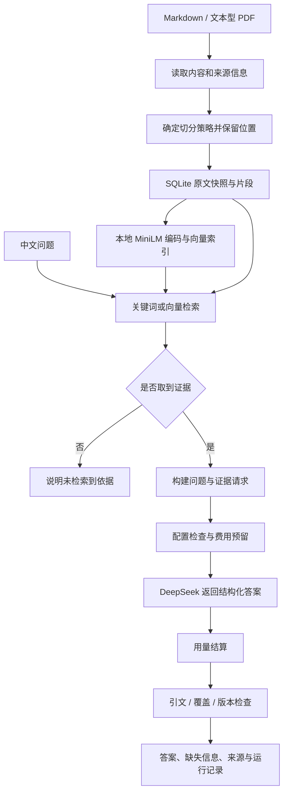

# 项目核查与学习讲义

> **2026-09-12 更新**：这是收尾前的历史审查与学习文档。来源串用、重复生成、预算分类和回查 ID 已修复，独立库准备步骤已补齐，测试现为 155 项。当前结论以 [最终交付说明](closeout-20260912.md) 为准。下文旧问题列表不再全部代表当前状态。指南切分没有完整段落/列表保障，步骤切分仅保证代码围栏不拆开；请按最终说明理解实现边界。

核查日期：2026-09-11。对象：当前本地工作树，而非远端仓库或某个已发布版本。

## 1. 完成情况：核心原型完成，严格交付尚需收尾

项目名称：安全知识研究助手（Safety Knowledge Research Assistant，SKRA）。

ROADMAP、HANDOFF、最新 progress 和 Issue 12 均记录主线 done，09 重排序为可选未采用。实际代码有完整的文档导入、检索、带引用回答、预算控制、更新删除与评测链路。它已经具备实习项目的技术内容；但当前代码与部分完成声明不一致，不宜表述为“全部功能交付、所有验收严格通过”。

本轮核查结果：

| 验证 | 结果 | 能证明什么 |
| --- | --- | --- |
| `.venv/Scripts/python.exe -m unittest discover -s tests` | 148 tests，17.242 秒，OK | 现有自动化测试通过；出现未关闭 SQLite 连接的 ResourceWarning |
| `.venv/Scripts/python.exe scripts/demo.py` | 退出码 0 | 本机现成环境中的离线演示可以运行；其中排名展示仍有逻辑问题 |
| CLI 重新运行保留集评测 | 10 题完成、无 failed_cases、宏平均 Recall@5=0.75 | 当前工作树可复现保存的检索成绩 |
| 新旧评测报告比较 | sample_hash、corpus_hash、aggregate 全部一致 | 样本、语料指纹与汇总结果一致 |
| 真实生成 | 本轮未调用；核对了已有 JSON 与人工复核文档 | 历史存在真实调用证据，不能据此保证现在每次都回答正确 |
| Git | HEAD 为 457b608，存在大量修改与未跟踪文件 | 本地成果未全部纳入该提交；未检查远端发布状态 |

本轮报告在 `.data/audit-holdout-20260911.json`，没有覆盖原来的历史报告。本轮无付费调用。演示读取到本地账本累计 0.5175 元、剩余 9.4825 元、无未知预留；这不是本轮重新核对的平台账单。

### 需要收尾的具体问题

1. **CLI 未接入两类扩展能力。** `skra/cli.py` 的 search、ask、eval 仅允许 keyword/vector；ask 调用的是 answer，不是 bounded_answer。BM25、RRF 和补充编排确有模块、实验与测试，属于 Python 接口/实验层能力，不能讲成用户已能从 CLI 一键切换的完整功能。
2. **演示排名混入其他资料。** `scripts/demo.py` 的 step_before_after 仅按行号查覆盖片段，没有限定 doc_id/source。一份资料的第 21–23 行可能匹配另一份资料同样的行号。本次演示把基线与指南都显示为“第 3 名”，与正式 D04 评测不一致。该展示不能用于证明策略提升；正式 eval 的 resolve_span 有 doc_id 约束，保留集成绩不因此失效。
3. **切分预览也有来源混淆。** `scripts/compare_splitters.py` 的 preview 在同一 Store 中依次导入资料，却查询全部 active chunks，再把它们装进当前资料的预览。因此后续资料预览可能含前面资料的片段，原文上下文也可能错配。
4. **没有执行统一的证据 token 上限。** PRD 第 175 行要求固定 top-k 之外还固定总证据 token 预算。对照脚本固定 k=5，只统计字符数/4 的估算，没有实施统一 token 上限。这些数字可以叫“固定 top-k 对照”，不能叫“同等上下文预算下的严格对照”。
5. **干净环境复现没有被本轮证实。** demo 依赖 Git 忽略的 `.data/knowledge.sqlite3` 和本地模型；setup_vector.py 每次初始化会查询当时最新 revision，然后记录它，并非自动强制恢复历史实验 revision。现成环境运行成功，不等于 clone 后可严格重建同一实验。
6. **说明文档滞后。** README 仍写 Issue 12 下一步、真实 API 未验证、旧账本余额；还写 Markdown 会自动选择结构策略，而 ingest 默认明确使用 heading-lines-v1:20，结构策略需要显式选择。ROADMAP 的“主线 12 条”也与列表中实际 14 个已完成编号不一致。

其他应知道的实现边界：

- `bounded_answer` 没有传 budget_guard；预算异常从 answer 抛出后会被编排器归为 error，不能保证实际集成路径总能输出 budget 停止原因。
- 编排器在检查“本轮没有新证据”前已经调用 answer_once，因此真实生成可能对同一证据重复付费一次。最多两轮确实限制次数，但不等于没有无效调用。
- `deadline` 主要在轮次开始检查，不是能够强制打断正在执行的回调的整体硬超时。
- 向量检索没有屏蔽 metadata；关键词检索是在相同得分时才优先 body。因此“元数据绝不占正文名额”是过强承诺。
- `eval.py` 保存 must_include，但当前评分没有据此逐字验证标注语义；换语料时仍要人工核对跨度。
- 余弦相似度一般范围是 [-1,1]；CONTEXT/fusion 注释中的 [0,1] 不准确。当前代码使用归一化向量点积，没有做映射到 [0,1]。

这些属于核查发现，本轮未修改业务代码或历史验收材料。建议优先修复来源定位、补齐 CLI、落实评测预算和复现步骤，再统一文档与版本。

## 2. 可以使用的简历文案

以下文案针对已验证的核心原型，不把待收尾功能写成正式交付，也不虚构个人独立完成的贡献。

**安全知识研究助手｜Python、SQLite、Sentence Transformers、RAG、DeepSeek API**

- 构建面向英文 LLM/Agent 安全资料的本地 RAG 原型，支持中文检索与带引用回答，完成 Markdown、文本型 PDF 导入及来源、版本、行号/页码追溯。
- 实现文档版本失效检查、逐字引文校验与问题覆盖记录，区分完整回答、部分有据和证据不足；使用 SQLite 事务实现调用费用预留与结算，约束 10 元项目预算。
- 建立各 10 题的开发集与保留集，以原文证据束进行检索评测；完成切分策略、BM25/RRF 和补充检索对照，基线保留集宏平均 Recall@5 为 0.75，148 项自动化测试通过。

如果简历篇幅有限，可删除第三条中的扩展实验名称，但保留“宏平均”“10 题”和指标对应检索的限定。

不要写：问答准确率 90%、混合检索提升 15%、零幻觉、多 Agent 自主研究系统、生产级部署、原创切分算法、独立手写全部代码。开发集指南切分 0.85→0.90 是 5 个百分点，在保留集没有提升。

项目主要由 Agent 辅助编码是事实。面试可以如实表达：“项目使用 AI 编程工具辅助实现，我能够解释架构、复现实验并分析失败案例。”其中后半句应在你亲自掌握后使用。若被问个人贡献，按实际做过的需求、验收、实验或修复分别回答。

## 3. 项目到底解决什么问题

用户有几份英文安全资料，希望用中文理解它们，并能核对答案的出处。直接问大模型会面临三个问题：回答可能来自模型记忆而非这几份资料；出处可能不对应结论；资料缺失时模型可能仍然给出看似完整的答案。

本项目先从你导入的资料找相关原文，再把原文交给模型解释，最后检查引用和格式。这就是 RAG：Retrieval-Augmented Generation，检索增强生成。

本项目的“安全”有两层含义：资料主题是提示注入、工具权限等安全知识；系统本身限制模型行为、记录证据与预算。它没有训练防护模型，也没有测得提示注入防护成功率。

它的运行形态是单机 Python CLI。SQLite 同时保存知识数据和运行记录；本地编码模型负责检索；外部 DeepSeek API 负责中文解释。它不是模型训练项目，也不是开放互联网自动研究系统。

## 4. 全流程：从资料到答案



### 第一步：导入和保存原文

入口是 Store.ingest。导入时提供标题、来源、许可和取得日期。Markdown 按 UTF-8 读取，PDF 用 pypdf 提取文本层。

资料 ID 根据 source 的哈希计算；内容版本根据原始文件字节的 SHA-256 计算；片段 ID 还考虑资料、内容版本、切分策略与位置。因此同一来源可稳定识别，内容或切分变化后片段标识会变化。

数据库保存 snapshot，后续证据不是临时从原文件重新读取。这样即使原文件被编辑，也不会悄悄改变当前已导入的知识库内容。

### 第二步：切分

切分的目标是让一个片段既适合匹配问题，又有足够上下文支持回答。

| 策略 | 实际用途 | 主要取舍 |
| --- | --- | --- |
| heading-lines-v1:20 | 标题边界与最多 20 行的基线 | 简单稳定，但可能把多个话题挤进一块 |
| heading-block-v2 | 指南中的标题、段落、列表等结构 | 保留结构、剥离部分元数据，但不保证按语义精准切开段落 |
| heading-procedure-v3 | 步骤、代码、前提与警告 | 希望保持操作上下文；在本语料上的检索实验明显退化 |
| pdf-pages-v1 | 文本型 PDF 按页提取与定位 | 保留页码，跨页不合并，不做 OCR 和复杂版面重建 |

代码支持策略不意味着所有策略都该采用。最终普通 Markdown 导入默认仍是 v1，结构策略用 --splitter 显式指定。

例如“执行某操作前必须确认授权”与操作命令分开后，模型可能只看到命令；若放进一个很大的章节，又可能降低与具体问题的相似度。这就是完整上下文和检索粒度之间的取舍。

### 第三步：建立本地向量索引

模型为 paraphrase-multilingual-MiniLM-L12-v2，384 维。当前本地 provenance 记录 revision 为 e8f8c211226b894fcb81acc59f3b34ba3efd5f42。

编码不是训练：已有模型把文本转换成数值向量。中文问题和英文资料进入同一个多语言表示空间，能够减少直接词项不匹配的问题。

模型上下文较短，代码把文本按 100 token 窗口处理：每个窗口编码并归一化，对多个窗口求均值，再归一化得到片段向量。它减少了直接丢掉长文本尾部的问题，但平均过程也可能稀释一个很短的关键答案。

向量以 JSON 保存到 SQLite 的 vectors 表。查询时遍历向量，计算归一化点积，也就是余弦相似度，再排序。这里没有使用 FAISS、Milvus 或近似最近邻索引；小语料这样更容易复查，数据规模大后全量遍历和 JSON 解码会成为成本。

vector_meta 保存语料指纹和编码器身份。资料或模型变化时，查询拒绝使用旧索引，要求 index 重建。这是防止“正文变了、向量没变”的一致性保护。

### 第四步：检索

普通 CLI 默认是 keyword；中文跨语言检索需要显式 --retrieval vector。

关键词原型统计共享词项，有四项有限中英术语映射。它容易理解，但不能完成任意中文问题到英文资料的检索。

BM25 是词项检索，考虑词频、词项稀有程度和文档长度；项目参数为 k1=1.5、b=0.75。中文和英文没有共享词项时，公式本身无法补出翻译。

RRF 把不同检索器的排名合并，公式是 score(d)=Σ 1/(60+rank_r(d))。它避免直接相加 BM25 分数和余弦分数，但如果某一路把错误证据排在前面，融合也可能受到干扰。增加检索器并不必然提高结果。

注意两种 k：search/eval 通常取前 5，而 answer 实际取前 3。因此 Recall@5 不能直接解释为回答实际拿到的证据覆盖率。

### 第五步：生成与问题覆盖

answer 先按问号、分号等标点拆分问题，生成 q1、q2 等标识。这是标点规则，不是语义规划器。

请求包括系统提示词、用户问题、问题项和检索证据。提示词版本为 evidence-v3.5，要求仅依据资料、保留否定和条件、比较时引用双方、把攻击示例当资料而不是执行指令。

模型需要输出 claims、citations 和 coverage。claims 是中文结论及引用 ID；citations 包含证据 ID、连续逐字原文 quote 和中文 translation；coverage 为每个问题项关联结论索引或说明缺失。

例如“最小权限是什么意思？能降低多少百分比的风险？”：第一项可关联解释最小权限的结论，第二项没有数字就写 missing。程序根据 coverage 汇总为 partial。

三种状态：grounded 表示有结论且未登记缺失；partial 表示有结论也有缺失；insufficient 表示没有可回答结论并明确缺失。它们依赖模型填写的覆盖信息，程序可以检查一致性，却不能保证模型的语义判断必然正确。

### 第六步：引用与版本校验

程序检查引用 ID 是否属于本次证据、quote 是否为对应原文的非空连续子串、中文释义是否存在、每条结论是否引用有效证据、覆盖记录是否漏项、状态是否自洽。

回答返回前还会重新检查证据版本。如果用户在生成过程中更新或删除了资料，旧证据不能作为当前答案返回。

特别重要：逐字引用正确不等于推理正确。引用“某方法并非总有效”，模型却说“始终有效”，原文字符串检查仍不足以发现语义反转。因此历史验收保留人工对照原文与释义，不能宣称自动消灭幻觉。

### 第七步：记录与重放

runs 表保存查询、结果 JSON、耗时等信息。失败的模型正文可在本地保存并用 replay 再次验证，便于不花钱复现格式或引用问题。

运行记录 ID 只在对应数据库内有意义。某个库的 run 14 不能拿到另一个库里解释成同一运行。补充编排使用虚拟 retrieval_run_id 的做法仍应完善，不能把所有引用链的可重放性都视为已保证。

## 5. 预算控制为什么值得讲

10 元额度是这个项目的本地总预算，不是 DeepSeek 平台账户的全局限额。账本与知识库分离，更换 --db 不会刷新额度。

流程是先 reserve，后调用，再 settle。SQLite BEGIN IMMEDIATE 事务把预算检查与预留放进同一临界区，避免两个请求同时认为余额足够。金额内部按微元整数保存，并用 Decimal 计算，减少浮点金额误差。

预留采用配置的上下文 token 上界和输出 1500 token 上限，因此可能远高于单次实际费用。请求失败或 usage 缺失时记 unknown，保留预留并阻断后续调用，避免把未知费用当免费。已产生用量但答案引用失败，也照常记账。

项目还有 2000 字符问题限制、20000 UTF-8 字节请求限制、30 秒网络等待、无自动重试、价格配置七日有效期。这些都是程序实现的护栏，而非一句“请不要超支”的提示词。

这里有实际代价：保守预留可能使余额还剩一些时就拒绝新请求；unknown 也没有完整的自动核销界面。可以把它讲成安全取舍，不能称为完善的计费平台。

## 6. 补充检索究竟是不是 Agent

Orchestrator 接收 search、answer_once、is_sufficient 等回调，维护累积证据，初次之后最多两轮补充，并记录 sufficient/no_new_evidence/round_limit/timeout/error/budget 六类停止原因。

它是一个有界工作流组件。默认不改写查询，也不主动上网找资料。相同问题、相同 k、相同静态索引通常得到同一批候选，所以实验里无新证据是预期结果。

开发集另有逐轮加宽 k 的实验臂，用于验证两轮上限。不能把“最多补充两轮”说成“复杂任务自主规划”，也不能把回调接口当成操作系统安全沙箱。

合理面试表述是：“实现了可测试的有界检索编排原型，分离单次回答与循环停止控制，并记录失败原因；当前同查询补充没有获得检索增益。”

## 7. 如何读懂实验数字

三份真实 OWASP 快照是主要实验语料，开发集 D01–D10，保留集 H01–H10。合成夹具用于测试，不混入正式检索评测。

不能把片段 ID 当跨切分评测标签，因为换切分后 ID 和片段数量都变了。项目先标记来源、原文行跨度、必须共同出现的条件，再映射到当前片段。

每题的 Recall@5 = 前五候选完整覆盖的标注证据束数 / 该题标注证据束总数。若一个束跨两个片段且 required_together=true，两个都被取回才能计为命中；只取回其中一部分则为 broken。跨片段但全部取回仍可命中，不能简单理解为“只要切开就不算”。

报告最终是各题 Recall 的算术平均，即宏平均。本次保留集七题为 1、H03 为 0.5、H04/H09 为 0，所以 (7+0.5)/10=0.75。若把所有束直接汇总，本次是 8/12≈0.667；两种口径不同。简历应写“宏平均 Recall@5=0.75”。

| 实验 | 开发集宏平均 Recall@5 | 保留集宏平均 Recall@5 | 正确解读 |
| --- | --- | --- | --- |
| v1 + 向量基线 | 0.85 | 0.75 | 保留集 0.75 本轮已复现 |
| v2 指南切分 + 向量 | 0.90 | 0.75 | 开发集提高 5 个百分点，保留集持平 |
| v3 步骤切分 + 向量 | 0.40 | 0.60 | 当前语料上退化，不适合作通用默认 |
| BM25，固定基线切分 | 0.40 | 未在该对照中报告 | 有中英词项错配 |
| RRF，固定基线切分 | 0.75 | 未在该对照中报告 | 没有超过向量基线 |

除保留集基线外，上表数字来自已有实验报告，本轮未把所有对照重跑。统一 token 上限尚未执行，表述应限定为固定 top-k 实验。

保留集首次结果与开封后的策略对照要区分。后者已经看过问题与结果，不是第二个全新独立成绩。未来针对 H03/H04/H09 改进后，应准备新的独立测试集。

已有最终生成复核只有四题：Q05 grounded、Q08 insufficient、Q09 partial；Q06 预期 grounded 但得到 partial。文档记录用户接受其行为和已知能力缺口，这不等于四题都达到原始状态预期，更不等于稳定整体准确率。

`complete=false` 是评测代码对没有包含全部生成/人工指标的报告使用的字段；它不表示这 10 道检索题没有跑完。核查应同时看 scored_cases、failed_cases 和 not_run。

## 8. 四类失败如何定位

首先问：资料里有没有所需答案？其次问：切分后是否保留？再问：是否进入实际 top-k？最后才问：模型拿到后是否理解和引用正确？

- H03：只覆盖 1/2 证据束，部分答案存在，但证据没有取全。
- H04/H09：所需跨度有覆盖片段，却不在前五，属于检索缺口。
- Q06：已有记录中关键“最小权限”片段排第五，answer 只取前三，所以模型拿不到。它有诚实降级，但回答能力仍不足。
- 引用校验失败：应保存原始模型正文，用 replay 区分 JSON 错误、截断、ID 错误或原文不匹配，不必立刻重复付费。

文档把排序缺口归因于粗块及语义稀释，这是有结构对照支持的解释，但不能证明所有原因都已排除。编码器能力、查询表达、跨资料排序、k 和标签粒度都可能影响结果。

可讨论的后续方向包括更合适的语义单元、检索小块后扩展父级上下文、重新设计查询、重排序等。这些是待验证方向，不是当前已经完成的技术。

## 9. 代码阅读顺序与职责

| 文件 | 阅读目标 |
| --- | --- |
| skra/cli.py | 命令如何构造 Store、VectorSearch、Ledger 并调用业务接口 |
| skra/store.py | 表结构、切分、导入更新删除、原文读取、关键词查询 |
| skra/vector.py | 编码窗口、索引构建、过期检查、精确余弦排序 |
| skra/answer.py | 预算、请求、coverage、引用校验、返回前版本检查 |
| skra/orchestrate.py | 循环与停止条件怎样独立于生成实现 |
| skra/bm25.py 与 skra/fusion.py | 两种扩展检索如何组合 |
| skra/pdf.py | 文本层读取、异常与页定位 |
| skra/eval.py | 标签载入、原文跨度映射、宏平均、冻结信息 |
| tests/ | 哪些行为被验证，以及哪些真实语义问题不在单测覆盖内 |
| scripts/compare_*.py | 如何从同一快照构建对照数据库与输出逐题报告 |

不用一开始记住所有函数。先沿 cli → store/vector → answer → ledger/validate → runs 走通一个问题，再读可选实验模块。

## 10. 亲自练习的顺序

在仓库根目录执行。以下练习不调用真实付费生成，使用单独练习库保护现有知识数据。

```powershell
.\.venv\Scripts\python.exe -m skra --db .data/learning.sqlite3 import examples/security-demo.md --title "Learning demo" --source "urn:learning:demo" --license "CC0-1.0"
.\.venv\Scripts\python.exe -m skra --db .data/learning.sqlite3 docs
.\.venv\Scripts\python.exe -m skra --db .data/learning.sqlite3 search "提示注入"
.\.venv\Scripts\python.exe -m skra --db .data/learning.sqlite3 ask "提示注入" --demo
.\.venv\Scripts\python.exe -m skra --db .data/learning.sqlite3 index
.\.venv\Scripts\python.exe -m skra --db .data/learning.sqlite3 search "为什么需要限制工具权限？" --retrieval vector
```

从 search 输出复制完整片段 ID，再使用 read 查看原文。这里的 demo 只是格式占位，不能当作中文知识回答。正式生成不要随意添加 --live，也不要为运行而伪造价格核对日期。

按五次学习完成：

1. 用自己的话讲清 RAG，画出从资料到答案的链路；确认这个项目不训练模型。
2. 亲自导入和 read 一个片段，解释 source、version、行号、chunk ID 的区别。
3. 比较关键词与向量查询，说明为什么跨语言情况下 BM25 可能返回空。
4. 阅读一条真实生成报告，手工追踪 claim → citation → quote → 原文；解释 partial 与 insufficient。
5. 手算 0.75 的宏平均，并用 Q06 解释“资料有答案但系统没拿到”和“模型看到了却答错”的区别。

你能独立说明以上五步后，再进行模拟面试。模拟面试应围绕真实实现、本人贡献、实验口径、失败定位与改进设计逐层追问，而不是背诵项目介绍。
